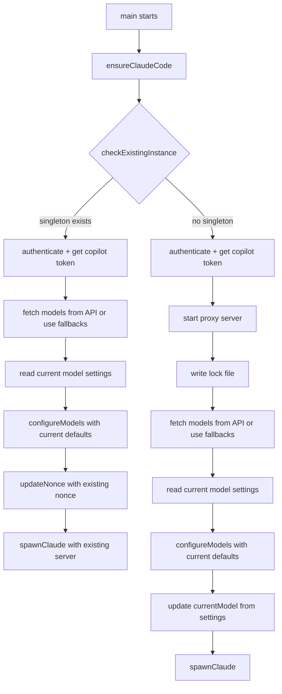

# Feature: Prompt Model Selection on Every Startup

## Summary

Currently, the model picker only appears on first run (when `ANTHROPIC_MODEL` is absent from `~/.claude/settings.json`). This feature changes the behavior so the interactive model picker is shown **every time** the app starts — including when reusing an existing singleton server. The previously selected model is pre-selected as the default so the user can press Enter to keep it, making the common case (no change) a single keypress. The `--reset-models` flag becomes unnecessary but is retained for backward compatibility.

## Changes Required

### 1. `src/config.ts`

| Change | Details |
|--------|---------|
| **Rename `configureFirstRun()` → `configureModels()`** | The function is no longer first-run-only. Update the log message from "First-time setup" to "Select your models" (or similar). |
| **Accept optional `currentPrimary` / `currentSmallFast` parameters** | `configureModels()` gains two optional string params representing the currently configured model IDs. These are used to compute a smarter `defaultIndex` for `pickModel()`. |
| **Compute `defaultIndex` from current selection** | Before calling `pickModel()`, find the index of the current model in the picker list. If found, pass that index as `defaultIndex`; otherwise fall back to index 0 (primary) / index 3 or last (small/fast). |
| **Show current model in prompt text** | Change the prompt strings to include the current model, e.g. `"Primary model — current: claude-sonnet-4"`. When there is no current model (true first run), omit the "current:" suffix. |
| **Export `configureModels` instead of `configureFirstRun`** | Update the export. Keep `configureFirstRun` as a deprecated alias if desired, or just rename everywhere. |

### 2. `src/main.ts`

| Change | Details |
|--------|---------|
| **Always run model selection** | Remove the `if (!hasModels)` guard around the model-fetch + configure block (lines 102-120). The model picker now runs unconditionally after the server is started. |
| **Read current models before prompting** | Before calling `configureModels()`, read settings to get the current `ANTHROPIC_MODEL` and `ANTHROPIC_SMALL_FAST_MODEL` values and pass them through. |
| **Singleton path: add model selection before `spawnClaude()`** | In the `if (existing)` branch (lines 39-49), insert model selection logic *before* calling `spawnClaude()`. This requires fetching models (authenticate + get copilot token or use fallbacks) and calling `configureModels()`. Because the singleton path currently skips authentication entirely, the simplest approach is to fetch models using fallback list only (no API call) for the singleton case — or authenticate and fetch models before checking the singleton. See Detailed Design below for the recommended approach. |
| **Update `currentModel` after picker** | After `configureModels()` returns, re-read `currentModel` via `getModel()` so the running server uses the newly selected model. |
| **Keep `--reset-models` working** | No change needed — it still clears the saved models, and since the picker now always runs, it effectively just clears the defaults shown. |

### 3. No other files need changes

`pickModel()`, `readSettings()`, `writeSettings()`, `hasModelConfig()`, `updateNonce()` — all remain as-is. The `singleton.ts`, `constants.ts`, `types.ts`, `server.ts`, `auth.ts`, and `copilot.ts` files are untouched.

## Detailed Design

### Flow Diagram



### Step-by-step: Fresh Start Path

1. `ensureClaudeCode()` — unchanged
2. `checkExistingInstance()` — returns `null`
3. Authenticate with GitHub, get Copilot token — unchanged
4. Start proxy server — unchanged
5. Write lock file — unchanged
6. **Fetch models** from Copilot API; fall back to `FALLBACK_MODELS` on error — same as current code but now unconditional
7. **Read current settings** to get `ANTHROPIC_MODEL` and `ANTHROPIC_SMALL_FAST_MODEL` (may be `undefined` on true first run)
8. **Call `configureModels(models, serverUrl, nonce, currentPrimary, currentSmallFast)`** — picker shows with current model pre-selected
9. **Re-read `currentModel`** via `getModel()` so the server closure picks up the new value
10. `spawnClaude()` — unchanged

### Step-by-step: Singleton Reuse Path

1. `ensureClaudeCode()` — unchanged
2. `checkExistingInstance()` — returns lock info
3. **Authenticate with GitHub** — NEW (currently skipped in singleton path)
4. **Exchange for Copilot token** — NEW (needed to fetch models from API)
5. **Fetch models** from API; fall back to `FALLBACK_MODELS` on error
6. **Read current settings** to get existing model values
7. **Call `configureModels(models, serverUrl, nonce, currentPrimary, currentSmallFast)`** where `serverUrl` is `http://127.0.0.1:{existing.port}` and `nonce` is `existing.nonce`
8. `spawnClaude()` with existing server — unchanged

> **Alternative for singleton path**: Skip authentication and always use `FALLBACK_MODELS` for the singleton picker. This avoids the latency of re-authenticating when a server is already running. The trade-off is that new models added to the API won't appear until a full restart. This is the **recommended simpler approach** — use fallback models in the singleton path.

### Default Selection UX

In `configureModels()`, the prompt and default are computed as follows:

```
Current ANTHROPIC_MODEL = "gpt-4.1"
Available models: ["claude-sonnet-4", "claude-opus-4", "gpt-4.1", "gpt-4.1-mini", "o4-mini"]

  Primary model — current: gpt-4.1
    1. claude-sonnet-4
    2. claude-opus-4
  → 3. gpt-4.1          ← default, press Enter to keep
    4. gpt-4.1-mini
    5. o4-mini

  Choice [3]: _
```

If the current model is not found in the available list (e.g., it was removed from the API), fall back to index 0.

### Handling `--reset-models`

The `--reset-models` flag continues to clear `ANTHROPIC_MODEL` / `ANTHROPIC_SMALL_FAST_MODEL` from settings before the picker runs. Since the picker now always runs, the practical effect is that the default selection resets to index 0 instead of the previously saved model. This is useful and backward-compatible.

## Edge Cases

### API Model Fetch Fails

**Behavior**: Same as today — catch the error, log a warning, and use `FALLBACK_MODELS` from `src/constants.ts`. The picker still appears with the fallback list. If the user's current model is in the fallback list, it remains pre-selected.

### User Presses Ctrl+C During Selection

**Behavior**: The `readline` interface closes, the Promise never resolves, and the process exits. This is the current behavior and is acceptable — the user intentionally aborted. No special handling needed.

### Singleton Server Being Reused

**Behavior**: Model selection happens in the new process before spawning Claude. The selected models are written to `~/.claude/settings.json`. The already-running proxy server reads the model dynamically via the `getModel()` closure on each request, so it picks up the new value automatically. No server restart required.

### No stdin Available (piped/non-interactive)

**Behavior**: If stdin is not a TTY (e.g., run from a script), the readline prompt will read EOF and resolve with the default. This means the previously selected model is kept silently — a reasonable fallback. This matches current behavior.

### True First Run (no settings file)

**Behavior**: `currentPrimary` and `currentSmallFast` are `undefined`. The picker shows with default indices (0 for primary, 3 or last for small/fast) — identical to current first-run behavior.

## Testing Considerations

### Existing Tests

- **`test/server.test.ts`** — No changes needed; it tests the HTTP proxy layer, not the config flow.
- **`test/translate*.test.ts`** — No changes needed; translation logic is unaffected.

### New/Modified Tests

| Test | Description |
|------|-------------|
| **`configureModels()` default index** | Unit test that verifies when `currentPrimary` matches a model in the list, that model's index is passed as `defaultIndex` to `pickModel()`. |
| **`configureModels()` missing current model** | Verify fallback to index 0 when `currentPrimary` is not in the model list. |
| **`configureModels()` with undefined current** | Verify first-run behavior (index 0 / 3) when no current model is provided. |
| **`main()` always-prompt flow** | Integration-style test (or manual verification) that model picker runs even when `hasModelConfig()` returns true. |
| **Singleton path model selection** | Verify that model selection occurs before `spawnClaude()` in the singleton reuse path. |

> Note: Since `pickModel()` reads from stdin, unit tests should mock `readline.createInterface` or test `configureModels()` with a controlled input stream.

## Migration

### Impact on Existing Users

- **Seamless** — existing users will simply see the model picker on their next startup. Their previously selected model is pre-selected as the default, so pressing Enter twice (primary + small/fast) keeps everything the same.
- **No config file changes** — the settings file format is unchanged.
- **No breaking CLI changes** — `--reset-models` still works, it just has less utility since models are always prompted.
- **Slightly slower startup** — users now must interact with two prompts (or press Enter twice) before Claude launches. This is the intentional trade-off of the feature.

### Possible Future Enhancement

Add a `--no-prompt` or `--quick` flag that skips the model picker and reuses saved settings, for users who want the old fast-start behavior. This is out of scope for the initial implementation.
